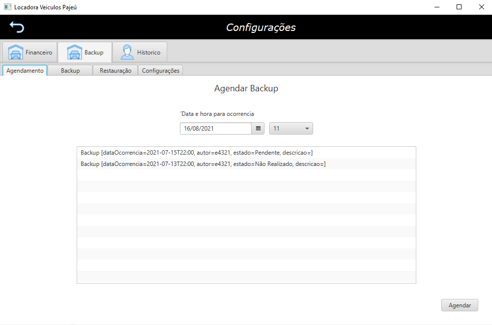

# Projeto acadêmico: Sistema para locadora de veiculos

    Este sistema foi inicialmente desenvolvido para a disciplina de Projeto de 
    Banco de Dados PBD. O referido também sofreu atualizações com introdução e 
    correção de padrões de projeto <i>(design patterns)</i>, tal atividade foi realizada como 
    projeto para a disciplina de Arquitetura de Software. 

## Descrição

    O sistema foi requisitado durante a disciplina PBD para uma locadora de  veículos
    fictícia, denominada <i>“Locadora de Veículos Pajeú"</i>. Neste momento, 
    foram dados/pensados diversos requisitos que podem ser melhor visualizados no 
    arquivo docs/Documentação.docs. Os principais requisitos são os de 
    possibilitar a realização de reservas de veículos por categoria e locação 
    de veículos em filiais da empresa. Diante dessa necessidade, diversos 
    dados foram requeridos. O diagrama ER ser visualizado a seguir:

## Padrões de projetos utilizados:
<ul>
    <li>Model-View-Controller(MVC);</li>
    <li>data access object (DAO);</li>
    <li>Business Objects(BO);</li>
    <li>Value Object(VO);</li>
    <li>facet;</li>
    <li>Singleton;</li>
    <li>Iterator;</li>
    <li>Memento;</li>
    <li>Observer;</li>
    <li>Template Method;</li>
    <li>Adapter.</li>
</ul>
 
 
## Tecnologias utilizadas:
<ul>
    <li>Linguagem de programação Java 10;</li>
    <li>API gráfica javaFX 8;</li>
    <li>Hibernate 5.5 / JPA 2.0;</li>
    <li>Eclipse IDE;</li>
    <li>Postgres SQL 13 / Pgadmin 4.</li>
</ul>

## Algumas telas da aplicação

O acesso ao sistema é realizado mediante a autenticação de usuários. O usuário pode
ser de três tipos a saber: 

<ul>
    <li>Administrador;</li>
    <li>Gerente ou</li>
    <li>Atendente.</li>
</ul>

    Cada tipo de usuário tem acesso a um conjunto de funções. Administradores e 
    gerentes têm acesso mais amplo e podem utilizar todas as funções da aplicação. 
    Atendentes têm acesso apenas a um subconjunto das funções, como os relacionados 
    à iniciação e acompanhamento de reservas e locações de veículos. Veja a seguir 
    a tela de login na <b><i>figura 1</i></b>.

### Figura 1 - Tela de login

    Após logado, na primeira tela apresentada, <b><i>figura 2</i></b>, é possível 
    verificar todas as reservas que estão agendadas para a data correte.

### Figura 2 - Tela de início

    Como citado, as principais funções são as de realização de reservas de veículos.
    A <b><i>figura 3</i></b> corresponde ao formulário que possibilita a realização 
    da reserva de categoria de veículos para determinada filial. A figura <b><i>figura 4</i></b> 
    é a de iniciação de locações, que pode ser realizada a partir de uma reserva previamente 
    feita.

### Figura 3 - Formulário para realização de reservas de categoria de veículo

### Figura 4 - Formulário para realização locação de veículo

    Outra funcionalidade é a verificação de disponibilidade de veículos em filiais, nessa verificação são 
    considerados até os veículos que estão previstos estar disponíveis na data informada, <b><i>figura 5</i></b>
    Tanto as reservas como locações podem ser gerenciadas a partir da seguinte tela <b><i>figura 6</i></b>. 
    Logo, é possibilitado o cancelamento ou finalização de reservas ou locações.

### Figura 5 - Disponibilidade de veículos em filiais

### Figura 6 - Acompanhamento de reservas e locações

    Demais dados, como filiais, clientes, veículos, categorias de veículos, acessórios de veículos, entre outros 
    podem ser manipulados através da seguinte tela, <b><i>figura 7</i></b>

### Figura 7 - Gerenciamento de dados

    Por fim, para gerentes e administradores, o sistema também possibilita visualizar relatórios financeiros, 
    como os de verificação de perdas por reservas não efetivadas e lucros com locações <b><i>figura 8</i></b>. 
    Também é possível realizar backup de todos os dados da aplicação, além de agendar um próximo backup, 
    <b><i>figura 9</i></b>. Além disso se pode visualizar todo o log de alterações dos dados por funcionários
    <b><i>figura 10</i></b>.

### Figura 8 - Relatórios financeiros

### Figura 9 - Agendamento, realização e configuração de backup

### Figura 10 - Verificação de log do sistema

